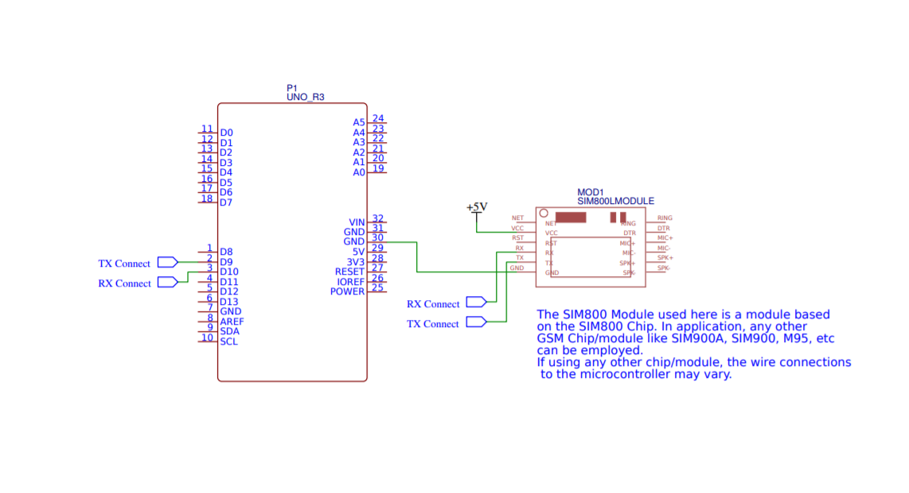
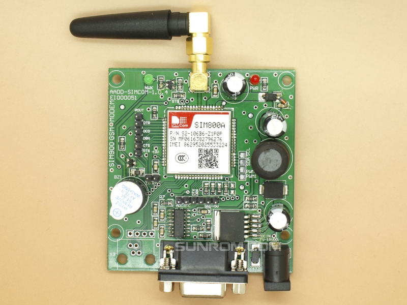

# Arduino SIM800 SMSReceive

Arduino C Code exercise for interfacing the Quad-band GSM/GPRS module SIM800 to Arduino UNO *(or any other microcontroller)* and interacting with the cellular network using AT commands.

### Objective

* Interface SIM800 and Arduino UNO through Software Serial Transmission

* Install a working SIM, connect to the cellular network and receive network responses through Serial Port

* Design a problem statement and solve it in Arduino C so as to test it in microcontroller environment

*Statement: The microcontroller should interface with the GSM Module and should be in the mode to receive text messages, when a text message is received on the installed SIM - it should extract the phone number of the sender from the network response text. The received message should be searched for a test string (about 32 characters long) and an alphanumeric code generated based on a fixed pattern (like a transaction id). The received message will contain a money amount in the currency of rupees (string format - `Rs.` followed by an amount in float type), this amount should be extracted and stored in a variable.*

*Once the above task are completed, the SIM800 should be switched to send SMS mode and a message stating the completion status of the transaction should be sent to the sender of the original text.*

### Hardware Information

* Technical Information for SIM800 Chip can be found [here](https://www.elecrow.com/wiki/images/2/20/SIM800_Series_AT_Command_Manual_V1.09.pdf).

* In order to interact and configure the SIM800 in various operating modes, AT commands are utilized. The list of AT commands can be found [here](http://mt-system.ru/sites/default/files/documents/sim800_hardware_design_v1.09.pdf).

### Interfacing the SIM800 to Arduino UNO:

The following schematic shows the connections required. The schematic shows a SIM800L module (which is a compact version for SIM800) but the connections for the boards are the same.

The SIM800 RS232 Modem board will be a good starting point for beginners as configuring it is easier and it includes an in-built antenna with 12 volt DC input.

*Image Source: [SUNROM](https://www.sunrom.com/p/gsm-modem-rs232-sim800a)*

### Useful Libraries

* Arduino Library `SoftwareSerial`: In Arduino boards, The TXD and RXD pins are designed for Serial communications. While using SIM800, the network response from the chip is received via Serial comm. so TXD and RXD pins can be used but these two pins are also used for uploading code to the board so the SIM800 has to be disconnected during code upload to the microcontroller.

    Using the `SoftwareSerial` serial library, any of PWM enabled pins of the arduino can be used for serial comm. so that the TXD and RXD pins will remain dedicated for code upload.

    **Note:** This library is included in Arduino IDE Installation

    Refer: [Arduino Docs](https://www.arduino.cc/en/Reference/SoftwareSerial)

* Arduino Library `RegExp`: The problem statement involves the task of pattern matching that can be easily tackled through regular expressions. There exists a community-created library by Nick Gammon that is based on the Lua library of the same. I have used it in solving the tasks in the problem statement.

    Refer: [Github Repo](https://github.com/nickgammon/Regexp)